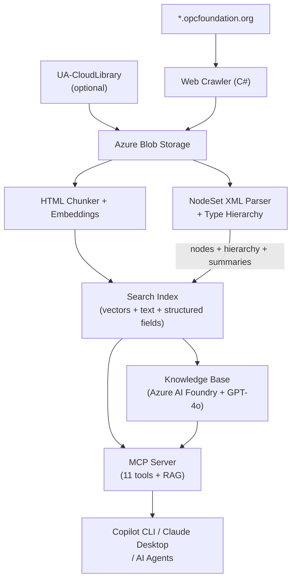

# OPC UA Knowledge Base MCP Server


[](https://github.com/marcschier/OpcUaKb/actions/workflows/ci.yml)
[](LICENSE)
[](https://dotnet.microsoft.com/download/dotnet/10.0)
[](https://modelcontextprotocol.io)
[](version.json)

<br clear="left"/>

An Azure AI Search agentic retrieval pipeline that exposes the complete OPC UA reference specifications as MCP endpoints for AI agents. Uses Azure AI Foundry with Managed Identity for keyless authentication.

## ✨ Key Features

🌐 **Comprehensive OPC UA coverage** — Over 180,000 indexed documents spanning the entire OPC Foundation reference library: specification text, tables, diagrams, and NodeSet XML definitions. Instead of manually searching across dozens of spec PDFs and web pages, your AI agent can query the full corpus in seconds.

🔧 **11 purpose-built MCP tools** — RAG Q&A, structured search, compliance validation, version comparison, and information model design suggestions — all accessible via a single MCP endpoint. AI agents can ask natural language questions, find specific ObjectTypes, check a NodeSet against a companion spec, or get help designing a new information model without leaving their workflow.

🏢 **Microsoft 365 Copilot agent** — Use the Knowledge Base directly from Microsoft Teams and Microsoft 365 Copilot Chat. The custom engine agent in [`agents/m365-agent/`](agents/m365-agent/) is a fully custom Bot Framework bot built on the Microsoft 365 Agents SDK and powered by the same Foundry GPT-4o + Azure AI Search RAG pipeline.

🧬 **Type hierarchy resolution** — Cross-file ObjectType inheritance is fully resolved with alias and namespace normalization. Every ObjectType includes its complete supertype chain, declared member counts, and inherited member totals. This is the kind of deep structural insight that's tedious to extract manually from XML files.

📊 **Version-aware indexing** — Every document is tagged with `is_latest` and `version_rank`, so queries default to the current spec version but can target any historical version. When a spec is updated, you can compare versions side-by-side to identify breaking changes per OPC 11030 §3.

☁️ **UA-CloudLibrary integration** — Downloads and indexes 450+ NodeSets from the [OPC Foundation Cloud Library](https://uacloudlibrary.opcfoundation.org), complete with download counts, publication dates, and version metadata. A single `list_specs` call shows which CloudLib entries overlap with official companion specs and where versions differ.

🧠 **RAG knowledge base** — Azure AI Foundry with GPT-4o provides natural-language query planning and answer synthesis. Ask a question in plain English and get a grounded answer with references to specific specification sections — useful for both newcomers learning OPC UA and experts looking up details quickly.

🔒 **Keyless authentication** — The entire stack uses Managed Identity for Azure OpenAI access. No API keys to rotate or leak — the pipeline, MCP server, and chat client all authenticate automatically via `DefaultAzureCredential`.

📈 **Popularity-boosted ranking** — Search results are ranked using a scoring profile that combines text relevance with adoption signals. OPC Foundation specs receive baseline priority; CloudLibrary entries are boosted by their download count on a logarithmic scale, so widely-adopted NodeSets like DI, Machinery, and PackML naturally surface first.

## 🏗️ Architecture



## 🔌 MCP Tools

The MCP server exposes 11 tools — structured search, RAG Q&A, compliance validation, and modelling:

### 🔍 Search & Discovery

<table>
<tr>
<td width="50%" valign="top">

**`search_nodes`** — Structured search with OData filters by node class, spec, parent type, modelling rule, and `source`. Version-aware with two-pass fallback.

</td>
<td width="50%" valign="top">

**`search_docs`** — Full-text search across HTML specification pages, tables, and diagrams. Version-aware.

</td>
</tr>
<tr>
<td valign="top">

**`get_type_hierarchy`** — ObjectType inheritance chain with declared/inherited member counts and supertype chain.

</td>
<td valign="top">

**`get_spec_summary`** — Pre-computed per-spec or cross-spec NodeSet statistics (node counts, top ObjectTypes). Filterable by `source`.

</td>
</tr>
<tr>
<td valign="top">

**`count_nodes`** — Faceted aggregation by node_class, spec_part, modelling_rule, data_type, or `source`.

</td>
<td valign="top">

**`list_specs`** — Ranked catalog with version, node count, popularity, and cross-source version comparison. Use `unique_to_source=true` to find CloudLib NodeSets not in the official index or with different versions.

</td>
</tr>
<tr>
<td valign="top" colspan="2">

**`search_docs_rag`** — Ask a natural language question about OPC UA and get an AI-synthesized answer grounded by the knowledge base. Uses KB retrieval + GPT-4o. Best for conceptual questions, protocol details, and security models.

</td>
</tr>
</table>

### 🛡️ Compliance & Modelling

<table>
<tr>
<td width="50%" valign="top">

**`validate_nodeset`** — Validate NodeSet XML against OPC UA standard and OPC 11030 best practices — checks naming conventions, modelling rules, type hierarchy, reference types.

</td>
<td width="50%" valign="top">

**`compare_versions`** — Compare two versions of a companion spec, classify changes as backward-compatible or breaking per OPC 11030 §3.

</td>
</tr>
<tr>
<td valign="top">

**`check_compliance`** — Check a NodeSet implementation against a companion spec — finds missing mandatory/optional nodes, data type mismatches.

</td>
<td valign="top">

**`suggest_model`** — Suggest OPC UA information model design based on a domain description, recommending base types from DI/Machinery/IA and OPC 11030 best practices.

</td>
</tr>
</table>

### Version Filtering

All search tools default to the **latest spec version** with automatic fallback to older versions if too few results:

| Parameter | Values | Effect |
|-----------|--------|--------|
| `version_mode` | `latest` (default) | Only current version |
| | `previous` | One version before latest |
| | `oldest` | Earliest available version |
| | `all` | Search across all versions |
| `spec_version` | `v104`, `v105`, `v200`, etc. | Specific version (overrides `version_mode`) |

## 🚀 Deploy

```bash
./infra/deploy.sh -s <subscription-id> -g rg-opcua-kb -p opcua-kb -l eastus
```

The script is idempotent. See [`infra/README.md`](infra/README.md) for full resource details, Bicep structure, and monitoring.

## 📦 Quick Install

```bash
# Hosted mode (recommended) — configures Copilot CLI + Claude Desktop
.\scripts\install-mcp.ps1 -Mode hosted -ApiKey <your-search-api-key>

# Or install as local dotnet tool
dotnet tool install -g OpcUaKb.McpServer
.\scripts\install-mcp.ps1 -Mode local -ApiKey <your-search-api-key>
```

See [`scripts/README.md`](scripts/README.md) for manual configuration and all client setup options.

## 🔗 MCP Endpoint

Single endpoint for all tools including RAG Q&A:

```
https://<mcp-server-fqdn>/
```

| Tier | Identification | Default Limit |
|------|---------------|---------------|
| Authenticated | Valid `api-key` header | Unlimited |
| Anonymous | No key (per IP) | 100 req/min |
| Blocked | `MCP_REQUIRE_AUTH=true` | 401 Unauthorized |

## 🤖 Microsoft 365 Copilot Agent

A **custom engine agent** (`agents/m365-agent/` + `src/OpcUaKb.Agent/`) lets you use the OPC UA Knowledge Base inside **Microsoft Teams** and **Microsoft 365 Copilot** as a conversational bot. Unlike a declarative agent, this is a fully custom Bot Framework agent — built on the Microsoft 365 Agents SDK, hosted on Azure Container Apps, and powered by the same Foundry GPT-4o + Azure AI Search RAG pipeline as our other tools.

```bash
# One command to deploy: creates Entra app, builds image, deploys Bicep, packages Teams manifest
./scripts/install-agent.sh        # Bash
.\scripts\install-agent.ps1       # PowerShell (Windows)
```

The script outputs a Teams app `.zip` ready to sideload via Teams Admin Center → Integrated apps → Upload Custom App. The agent then appears in Teams chats and Microsoft 365 Copilot.

| Channel | Status |
|---|---|
| Microsoft Teams (personal, group, channel) | ✅ |
| Microsoft 365 Copilot Chat | ✅ |
| Bot Framework Web Chat (testing) | ✅ |

See [`agents/m365-agent/README.md`](agents/m365-agent/README.md) for setup details, local development with `teamsapptester`, and manual deployment options.

## 💬 Local Development

For local interactive testing, run the agent web app and chat with it via the Microsoft 365 Agents Playground:

```bash
# Terminal 1: run the agent locally
SEARCH_API_KEY="$(az search admin-key show --service-name <prefix>-search -g <rg> --query primaryKey -o tsv)"
AOAI_API_KEY="$(az cognitiveservices account keys list -n <prefix>-foundry -g <rg> --query key1 -o tsv)"
AOAI_ENDPOINT="https://<prefix>-foundry.openai.azure.com"
dotnet run --project src/OpcUaKb.Agent
# Terminal 2: launch the playground (requires npm)
npm install -g @microsoft/teams-app-test-tool
teamsapptester
```

The Agents Playground opens in your browser and connects to the local agent on port 3978.

## ⚙️ Pipeline

Weekly crawl + index pipeline (Sunday 2am UTC, Container Apps Job, 24h timeout):

| Phase | Description |
|-------|-------------|
| **Crawl** | BFS crawl of `*.opcfoundation.org`. Incremental with state tracking. |
| **Index** | HTML → chunks → embeddings (`text-embedding-3-large`) → Azure AI Search. |
| **NodeSet** | Parse XMLs, build type hierarchy, generate summaries + hierarchy docs. |
| **CloudLib** *(optional)* | Download 450+ NodeSets from [UA-CloudLibrary](https://uacloudlibrary.opcfoundation.org), index as `cloudlib_*` content types. |

See [`src/README.md`](src/README.md) for running locally, project details, and search index schema.
